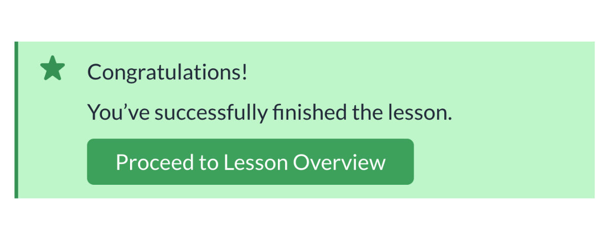

# Welcome to AlertsDLX

<figure><figcaption>
AlertsDLX Comes with Four Alert Block Themes
</figcaption></figure>

## AlertsDLX Overview

\[alertsdlx alert\_group="chakra" alert\_type="success" alert\_title="Now Supports Shortcodes!"]You can use shortcodes if the block editor is not enabled.\[/alertsdlx]

Four blocks and one powerful shortcode to display beautiful alerts and notifications.

See [Shortcode Usage](shortcodes/alertsdlx.md) for the full `[alertsdlx]` reference.

AlertsDLX is designed to be an easy-to-use alert block for the WordPress Block Editor and comes with **four** alert blocks inspired by popular UI libraries.

\[alertsdlx alert\_group="chakra" alert\_type="info" alert\_title="Download"][Visit AlertsDLX on the WordPress Plugin Directory](https://wordpress.org/plugins/alerts-dlx/)\[/alertsdlx]

Each block represents an alert component from a major UI library. You can use the links below to preview what the alert component should look like for each library.

* [Material UI](https://mui.com/material-ui/react-alert/)
* [Bootstrap](https://getbootstrap.com/docs/5.0/components/alerts/)
* [Chakra UI](https://chakra-ui.com/docs/components/alert)
* [Shoelace](https://shoelace.style/)

The end result is an intuitive interface for quickly spinning up an alert box in almost any style.

<figure><figcaption>
AlertsDLX Block in the Block Editor
</figcaption></figure>

<figure><figcaption>
AlertsDLX Block on the Frontend
</figcaption></figure>

## What's New in 2.4.0

* **Admin settings** under Settings → AlertsDLX — headline element, custom title classes, force headline size, and enabled block themes. See [Finding the Admin Settings](getting-started/finding-the-admin-settings.md).
* **Dismissible alerts** with cookie-based expiration. See [Dismissible Alerts](overview/dismissible-alerts.md).
* **Toolbar shortcuts** for style, visibility toggles, and close expiration.
* **Aligned sidebars** across all four block themes.

## Explore the Docs

* [Features](overview/features.md)
* [Screenshots](overview/screenshots.md)
* [Use Cases](overview/use-cases.md)
* [Installation](getting-started/installation.md)

## Helpful Links

* [AlertsDLX Home](https://dlxplugins.com/plugins/alertsdlx/)
* [Download on WordPress.org](https://wordpress.org/plugins/alerts-dlx/)
* [Support](https://dlxplugins.com/support/)
* [Contact](https://dlxplugins.com/contact/)
