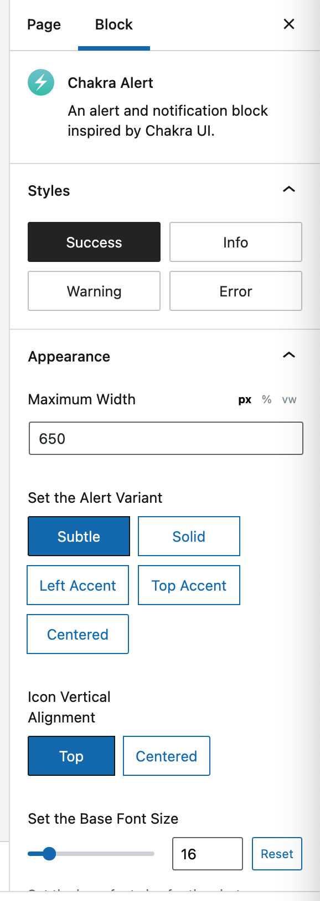

# Alert Blocks Overview

All four AlertsDLX blocks (Bootstrap, Chakra, Material, Shoelace) share the same core options. This page covers shared behavior; theme-specific alert types and variants are listed at the end.

## Block Toolbar (2.4.0+)

The block toolbar provides quick access to common options:

### Style Picker

Change alert type (info, success, warning, error, custom, etc.) from the toolbar. Selecting **Custom** opens the **Styles** sidebar panel so you can adjust custom colors.

### Visibility Toggles

Toggle these elements on or off from the toolbar:

* Icon
* Title
* Description
* Button
* Close button

### Close Expiration

When the close button is enabled, use the **Close expiration** toolbar dropdown to set how long dismissal is remembered (session-only, 1 hour, 24 hours, 7 days, etc.). See [Dismissible Alerts](../overview/dismissible-alerts.md).

### Inner Block Navigation

Child blocks (the alert description area) include a toolbar shortcut to jump back to the parent alert block and open its **Settings** or **Styles** panel — even when the sidebar is closed.

## Sidebar Panels

As of 2.4.0, sidebars are aligned across all four blocks:

### Styles Tab

* Block style / alert type
* Variant (theme-specific)
* Light or dark mode (where supported)
* Custom colors (when alert type is Custom)
* Maximum width and base font size

### Settings Tab

* Icon picker (tabbed: preset icons and custom SVG)
* Image icon option
* Title, description, button, and close button toggles
* Button label and link (duplicated in sidebar for convenience)
* Editorial Only mode
* Flexible InnerBlocks (Advanced)

<figure><figcaption>
Chakra Alert Sidebar Options
</figcaption></figure>

## Icon Picker

The icon picker uses a tabbed interface:

1. **Icons** — Choose from Material, Chakra, and Bootstrap icon sets.
2. **Custom SVG** — Paste your own SVG markup.

You can also use a custom **image** as the icon via the image URL option.

<figure><figcaption>
Icon Selector
</figcaption></figure>

## Button and Link Options

Enable the button in the toolbar or sidebar, then set:

* Button text
* URL (with improved search for posts and pages)
* Open in new tab
* `rel` attributes (nofollow, sponsored)

Button options are available on the block itself and in the sidebar.

<figure><figcaption>
Button Link Options
</figcaption></figure>

## Alignment and Width

Supported alignments: **center**, **wide**, and **full**.

Use **Maximum Width** in the Styles tab to cap alert width on large screens (px, %, vw, etc.).

## Theme-Specific Alert Types and Variants

### Bootstrap

Inspired by [Bootstrap Alerts](https://getbootstrap.com/docs/5.0/components/alerts/).

**Alert types:** primary, secondary, success, danger, warning, info, light, dark, custom

**Variants:** default, centered

Dark mode is not available for Bootstrap alerts.

### Chakra

Inspired by [Chakra UI Alert](https://chakra-ui.com/docs/components/alert).

**Alert types:** success, info, warning, error, custom

**Variants:** subtle, solid, left-accent, top-accent, centered

### Material

Inspired by [Material UI Alert](https://mui.com/material-ui/react-alert/).

**Alert types:** success, info, warning, error, custom

**Variants:** default, outlined, filled, centered

### Shoelace

Inspired by [Shoelace Alert](https://shoelace.style/).

**Alert types:** primary, success, neutral, warning, danger, custom

**Variants:** top-accent, left-accent, solid, centered

## Related Topics

* [Features](../overview/features.md) — Full feature list with screenshots.
* [Editorial-Only Blocks](../overview/editorial-only-blocks.md)
* [Flexible Inner Blocks](../overview/flexible-inner-blocks.md)
* [Shortcode Usage](../shortcodes/alertsdlx.md) — Same options via `[alertsdlx]`.
