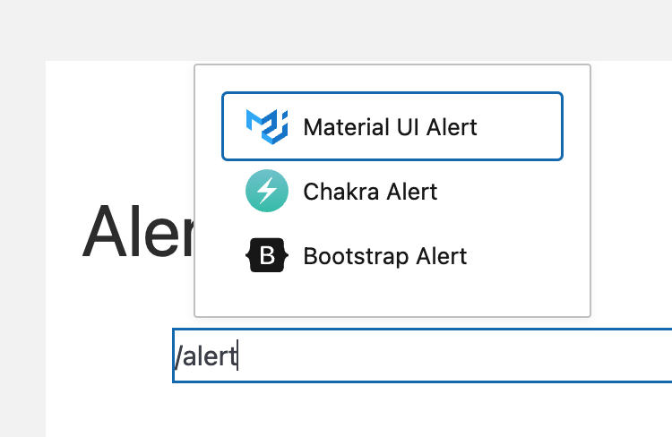

# Finding the Blocks

AlertsDLX comes with four alert blocks — one for each supported UI library theme.

## Block Category

You can find alert blocks in the block inserter (+ button) under the **AlertsDLX** category.

Available blocks:

* **Bootstrap Alert**
* **Chakra Alert**
* **Material Alert**
* **Shoelace Alert**

## Slash Command

Type `/alert` in the editor to quickly search for alert blocks.

<figure><figcaption>
Slash Command to Find Alert Blocks
</figcaption></figure>

## Enabled Block Themes Setting

Under **Settings → AlertsDLX**, you can enable or disable individual block themes. Disabled themes are hidden from the block inserter but do not affect alerts already on your site.

See [Finding the Admin Settings](../getting-started/finding-the-admin-settings.md).

## What's Next?

* [Alert Blocks Overview](alert-blocks-overview.md) — Configure styles, toolbar options, icons, and buttons.
