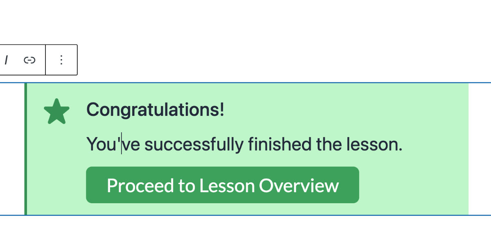

# Installation

## Install from the WordPress Admin

<figure><figcaption>
AlertsDLX Block in the Block Editor
</figcaption></figure>

1. Log into your WordPress admin (your dashboard).
2. Go to **Plugins → Add New**.
3. Search for **Alerts DLX** (or **AlertsDLX**).
4. Click **Install Now**, then **Activate**.

After activation, AlertsDLX blocks are available in the block editor. Site-wide options are available under **Settings → AlertsDLX**. See [Finding the Admin Settings](finding-the-admin-settings.md).

## Requirements

* WordPress 6.8 or newer
* PHP 8.0 or newer

## What's Next?

* [Finding the Blocks](../blocks/finding-the-blocks.md) — Locate alert blocks in the editor.
* [Alert Blocks Overview](../blocks/alert-blocks-overview.md) — Configure styles, icons, buttons, and more.
* [Shortcode Usage](../shortcodes/alertsdlx.md) — Use alerts outside the block editor.
