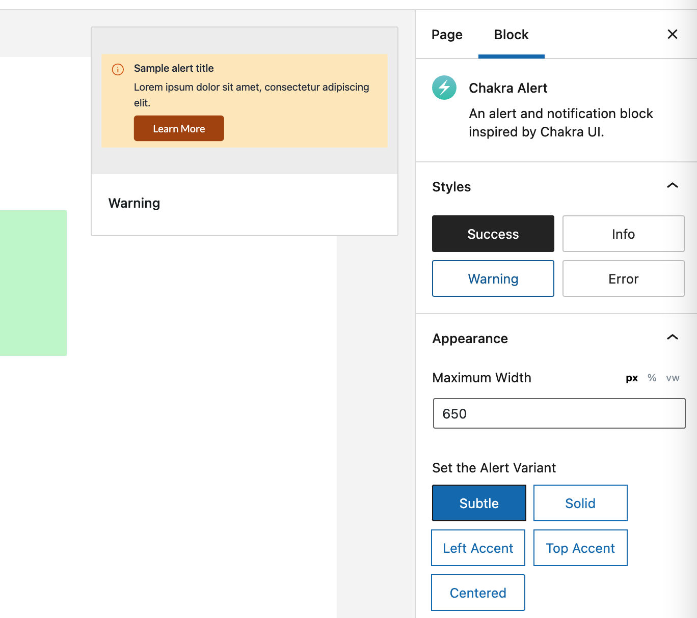
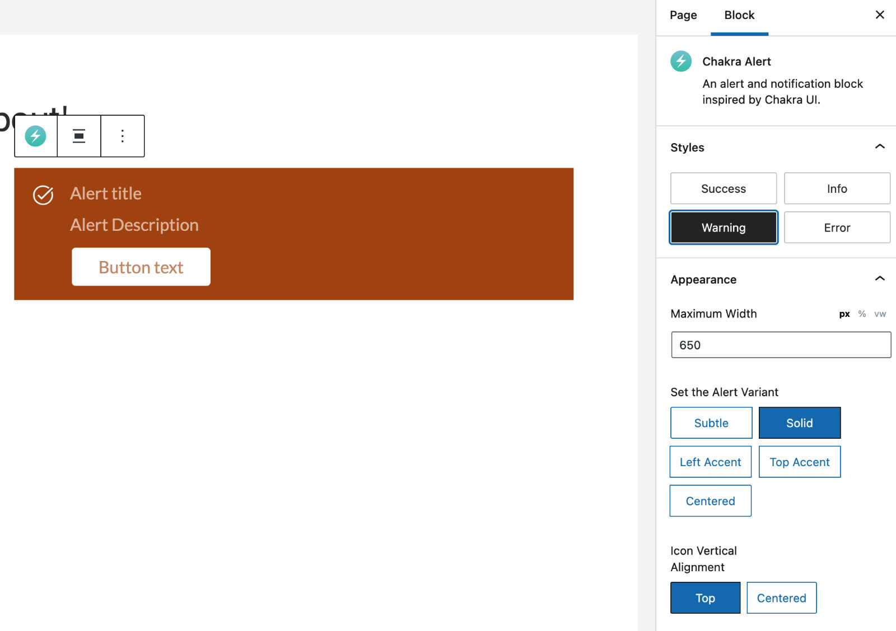
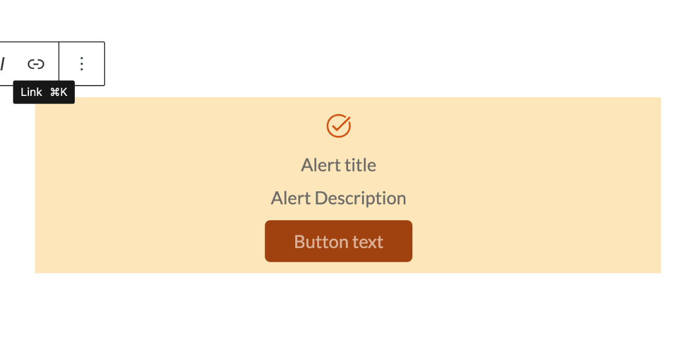
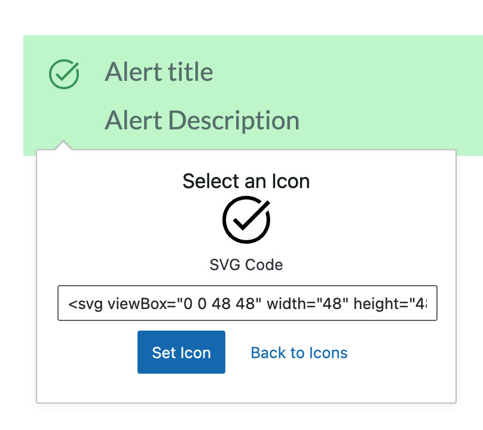
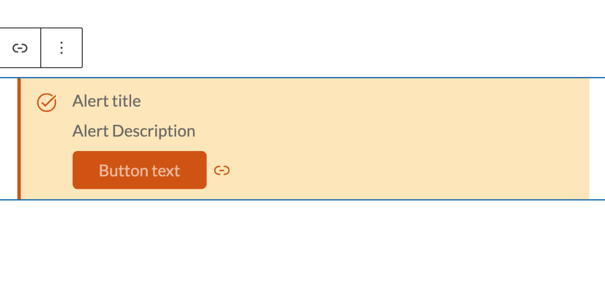
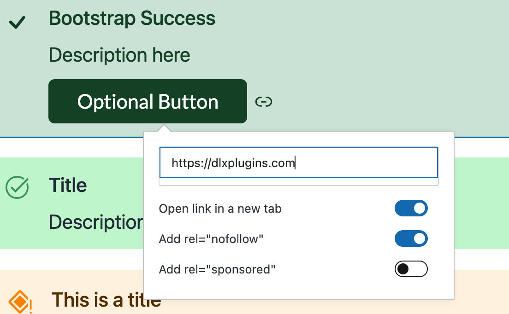
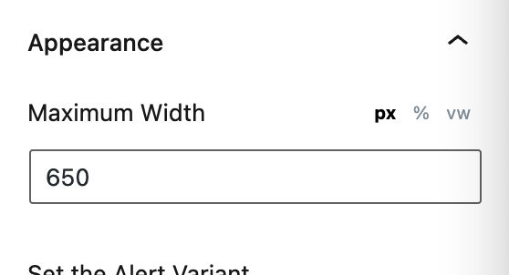
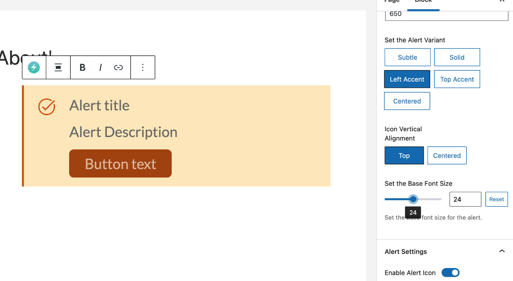
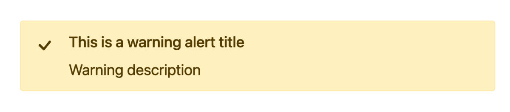

# Features

For such a small plugin, AlertsDLX comes with many features.

### Shortcode and Block Support

Whether using the classic or block editor, you can use AlertsDLX to output beautiful alert boxes.

See [Shortcode Usage](../shortcodes/alertsdlx.md) for the full `[alertsdlx]` reference.

### Four Alert Blocks — and Many Styles to Choose From

The plugin comes with blocks inspired by four UI component libraries:

* Bootstrap
* Chakra
* Material
* Shoelace

Each has its own unique style and variations, which can be configured on the block itself or in the sidebar options.

<figure><figcaption>
Chakra Alert Sidebar Options
</figcaption></figure>

### Styles Make the Block Customizable

Each block has several theme styles to choose from. For example, the Bootstrap alert block has a handful of available style options.

<figure><figcaption>
Bootstrap Alert Block with Several Style Options
</figcaption></figure>

Please view the example below for how multiple blocks can look depending on the style chosen.

<figure><figcaption>
Different Alert Styles
</figcaption></figure>

### Style Variants

In addition to different styles, each block has its own variants.

<figure><figcaption>
Chakra Alert Block With Warning Style and Solid Variant
</figcaption></figure>

Here's an example of a centered variant of the Warning style.

<figure><figcaption>
Chakra UI Centered Variant (Warning style)
</figcaption></figure>

### Icon Selector

AlertsDLX comes with a custom icon selector that allows for easy insertion of different icons.

Simply click on the icon and you'll be able to select a new one.

<figure><figcaption>
The Icon Selector Makes Selecting an Icon Easy
</figcaption></figure>

In addition to icons, you can also insert your own SVGs instead of the pre-selected icons.

<figure><figcaption>
Insert Custom SVG Code for Custom Icons
</figcaption></figure>

\[alertsdlx alert\_group="chakra" alert\_type="info" alert\_title="Inspired by GenerateBlocks"]The icon selector and SVG compatibility was inspired by the [GenerateBlocks](https://wordpress.org/plugins/generateblocks/) plugin.\[/alertsdlx]

AlertsDLX has icons from the following sources.

* [Google Fonts Material Icons](https://fonts.google.com/icons)
* [Chakra UI Icons](https://github.com/chakra-ui/chakra-ui/tree/main/packages/components/icons/src) (GitHub)
* [Bootstrap Icons](https://icons.getbootstrap.com/)

### Disable or Enable Elements

With the block options, you can enable or disable the title, description, icon, and button.

<figure><figcaption>
Enable or Disable Alert Options
</figcaption></figure>

For example, a button isn't shown by default. You can enable a button using the above options.

<figure><figcaption>
Chakra Alert with a Button
</figcaption></figure>

\[alertsdlx alert\_group="chakra" alert\_type="info" alert\_title="Buttons"]The UI libraries didn't include button styles, but CTAs are important for alerts, so it was added in as a feature.\[/alertsdlx]

### Button Link Options

With the inclusion of buttons comes a mechanism to link out to your resource. Add a link and set it to launch in a new window, and modify the `rel` attributes for nofollow or sponsored links.

<figure><figcaption>
Button Link Options
</figcaption></figure>

### Set the Container's Maximum Width

The block has different alignment options, but if you choose a centered, wide, or full-width alignment, you may find the block to be too wide when viewed on the front-end.

With a Maximum Width option, you can adjust how wide your alert block can be when viewed at wider widths.

<figure><figcaption>
Maximum Width Option
</figcaption></figure>

Each width can be adjusted via pixel, percentage, or viewport width.

### Change the Base Font Size

The styles for the alert blocks are all relative to a base font size. You can adjust this base to be smaller or bigger depending on your needs.

<figure><figcaption>
Adjust a Base Font Size
</figcaption></figure>

### Typography

The Lato Google Font is used on the front-end to allow the alerts to stand out even more. You can disable it and use your own font via filters — see [Custom Fonts](../developers/custom-fonts.md).

<figure><figcaption>
Chakra Solid Info Alert Block
</figcaption></figure>

<figure><figcaption>
Bootstrap Warning Alert Block
</figcaption></figure>

### Site-Wide Admin Settings (2.4.0+)

Configure headline elements, custom title classes, enabled block themes, and more under **Settings → AlertsDLX**. See [Finding the Admin Settings](../getting-started/finding-the-admin-settings.md).
