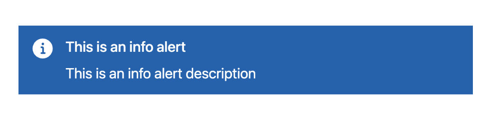
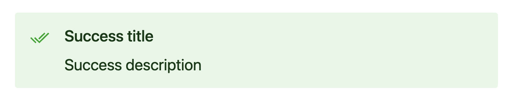
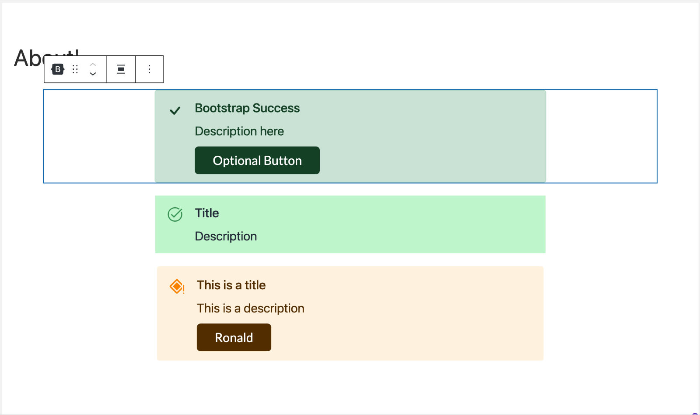
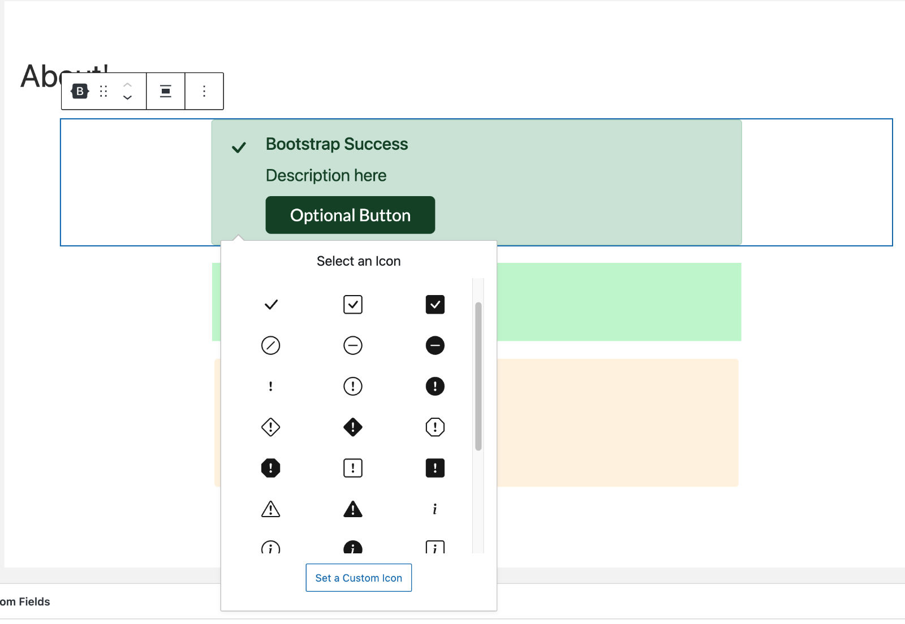
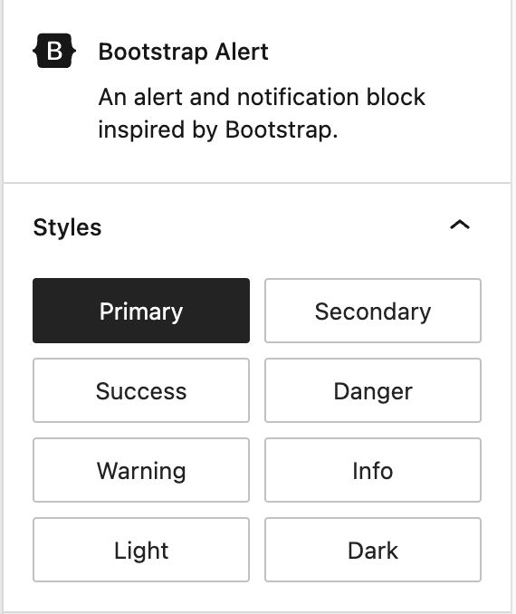
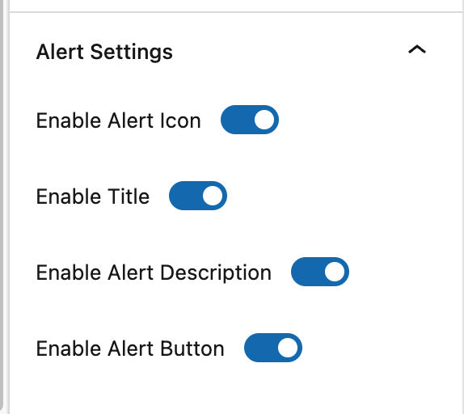
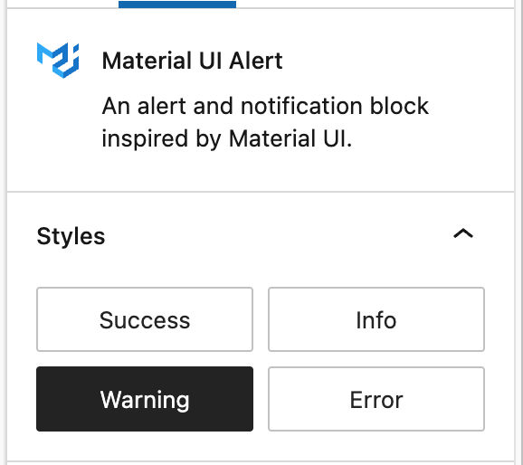
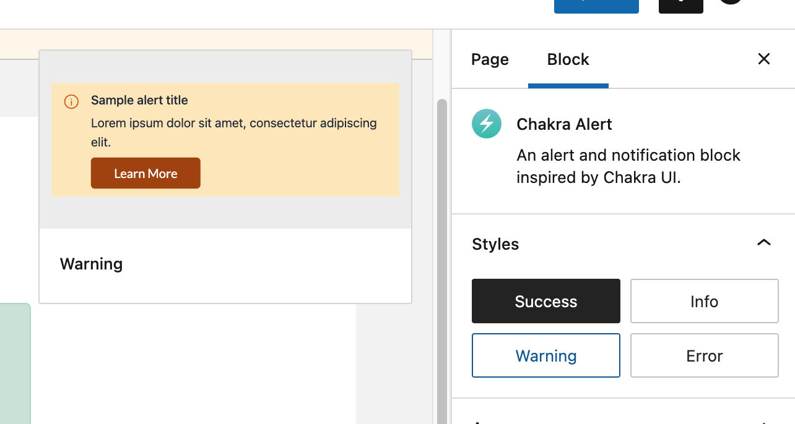

# Screenshots

## Frontend Screenshots

<figure><figcaption>
Chakra UI Solid Variant
</figcaption></figure>

<figure><figcaption>
Success Alert Block
</figcaption></figure>

## Block Editor Screenshots

Here are several screenshots from within the Block Editor.

<figure><figcaption>
Three Alert Blocks in the Block Editor
</figcaption></figure> <figure><figcaption>
Advanced Icon Selector
</figcaption></figure> <figure><figcaption>
Bootstrap Theme Styles
</figcaption></figure> <figure><figcaption>
Alert Block Settings
</figcaption></figure> <figure><figcaption>
Material UI Theme Styles
</figcaption></figure> <figure><figcaption>
Chakra UI Theme Styles with Theme Preview
</figcaption></figure>

